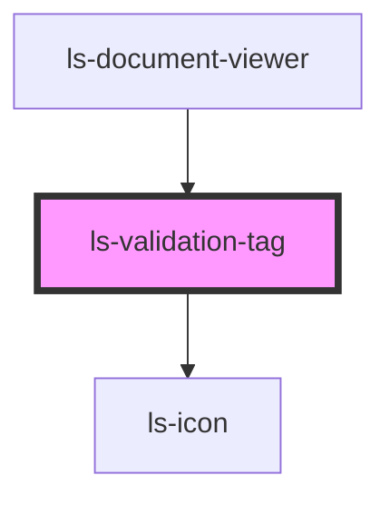

# ls-validation-tag

<!-- Auto Generated Below -->

## Properties

| Property           | Attribute           | Description | Type                | Default     |
| ------------------ | ------------------- | ----------- | ------------------- | ----------- |
| `isExpanded`       | `is-expanded`       |             | `boolean`           | `false`     |
| `showDropDown`     | `show-drop-down`    |             | `boolean`           | `true`      |
| `status`           | `status`            |             | `string`            | `'Invalid'` |
| `validationErrors` | `validation-errors` |             | `ValidationError[]` | `[]`        |

## Dependencies

### Used by

 - [ls-document-viewer](../ls-document-viewer)

### Depends on

- [ls-icon](../ls-icon)

### Graph

----------------------------------------------

*Built with [StencilJS](https://stenciljs.com/)*
