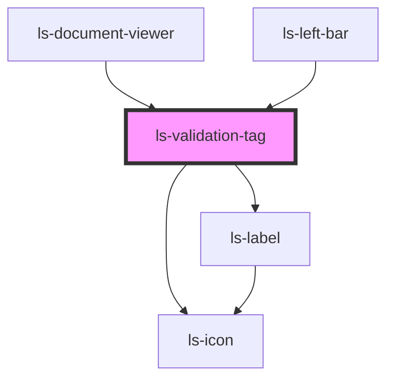

# ls-validation-tag

<!-- Auto Generated Below -->

## Properties

| Property           | Attribute        | Description | Type                     | Default     |
| ------------------ | ---------------- | ----------- | ------------------------ | ----------- |
| `isExpanded`       | `is-expanded`    |             | `boolean`                | `false`     |
| `showDropDown`     | `show-drop-down` |             | `boolean`                | `true`      |
| `status`           | `status`         |             | `string`                 | `'Invalid'` |
| `type`             | `type`           |             | `"compose" \| "default"` | `'default'` |
| `validationErrors` | --               |             | `ValidationError[]`      | `[]`        |

## Events

| Event                     | Description | Type                                                       |
| ------------------------- | ----------- | ---------------------------------------------------------- |
| `changeSigner`            |             | `CustomEvent<number>`                                      |
| `selectFieldForPlacement` |             | `CustomEvent<{ signerIndex: number; fieldType: string; }>` |
| `selectFields`            |             | `CustomEvent<LSApiElement[]>`                              |

## Dependencies

### Used by

 - [ls-document-viewer](../ls-document-viewer)
 - [ls-left-bar](../ls-left-bar)

### Depends on

- ls-icon
- ls-label

### Graph

```mermaid
graph TD;
  ls-validation-tag --> ls-icon
  ls-validation-tag --> ls-label
  ls-label --> ls-icon
  ls-document-viewer --> ls-validation-tag
  ls-left-bar --> ls-validation-tag
  style ls-validation-tag fill:#f9f,stroke:#333,stroke-width:4px
```

----------------------------------------------

*Built with [StencilJS](https://stenciljs.com/)*
